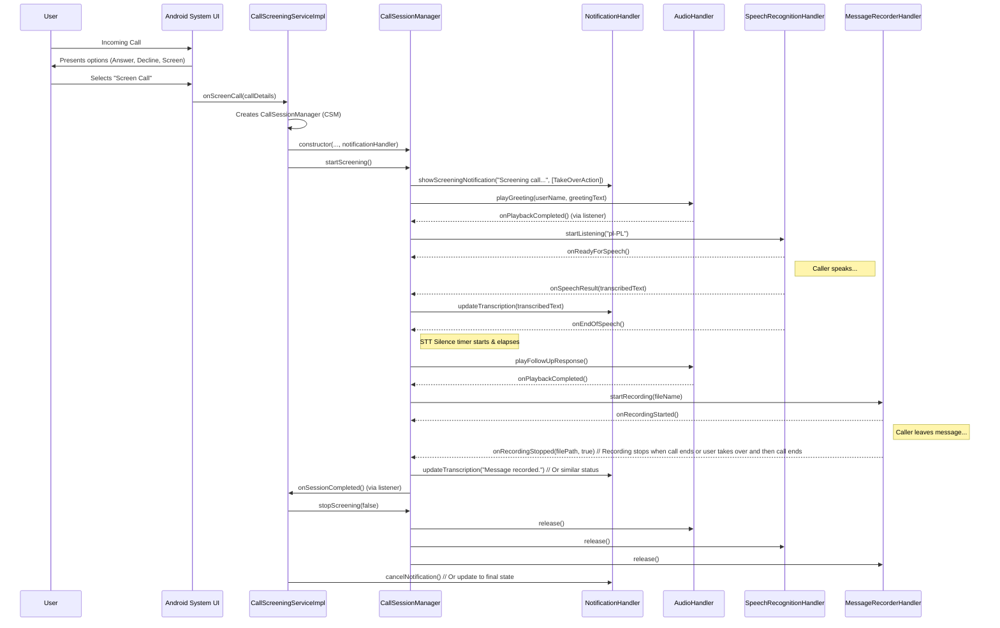
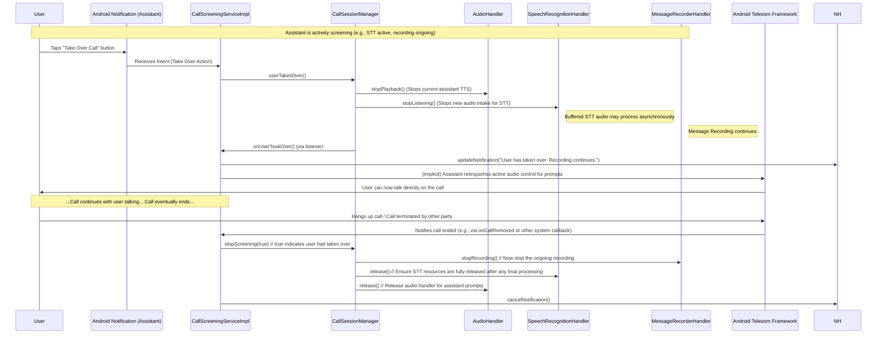

# Virtual Call Screening Assistant - Application Specification

## Overview

The Virtual Call Screening Assistant is an Android application that allows users to screen incoming calls from unknown or suspicious numbers using an AI-powered virtual assistant. The assistant interacts with callers by greeting them, transcribing their responses in real-time, and asking if they would like to leave a message. The MVP version relies solely on on-device capabilities. Crucially, the audio recordings captured during screened calls in the MVP are not only for user review but also serve as a vital dataset for future analysis and iterative improvements to the assistant's conversational intelligence, such as enhanced pause detection and more contextually aware automated responses.

---

## MVP Features

1. **Manual Call Screening Trigger**

   * User chooses to answer a call via "Answer with Assistant" button on the incoming call notification.
   * Regular calls remain unaffected and proceed through the stock dialer.

2. **Assistant Greeting**

   * Plays a pre-recorded or synthesized message:

     > "Hi, you've reached \[User's Name]'s phone. This is their virtual assistant. This call is being recorded. How can I help you?"

3. **Real-time Speech-to-Text (STT)**

   * Uses Android's on-device `SpeechRecognizer` API.
   * Supports Polish language (`pl-PL` locale).
   * Provides live transcription of caller responses.

4. **Predefined Assistant Responses**

   * After caller finishes speaking, assistant plays a follow-up message:

     > "Thank you. \[User's Name] is not available right now. Would you like to leave a message?"

5. **Message Recording Prompt**

   * Allows caller to leave a short message.
   * Saves audio locally for user review.

6. **Privacy Notification**

   * Clearly informs callers that the call is being recorded.

7. **Pre-recorded Message Playback**

   * Uses `MediaPlayer` to play predefined audio files for fixed responses.

---

## Implementation Guidelines

### Speech-to-Text (STT)

* Use Android `SpeechRecognizer` API.
* Ensure offline model for Polish (`pl-PL`) is available.
* Example:

  ```java
  SpeechRecognizer recognizer = SpeechRecognizer.createSpeechRecognizer(context);
  Intent intent = new Intent(RecognizerIntent.ACTION_RECOGNIZE_SPEECH);
  intent.putExtra(RecognizerIntent.EXTRA_LANGUAGE, "pl-PL");
  recognizer.startListening(intent);
  ```

### Text-to-Speech (TTS)

* Use Android `TextToSpeech` API with Polish locale.
* Example:

  ```java
  TextToSpeech tts = new TextToSpeech(context, status -> {
      if (status == TextToSpeech.SUCCESS) {
          tts.setLanguage(new Locale("pl", "PL"));
      }
  });
  ```

### Pre-recorded Audio

* Store audio files in `res/raw/`.
* Example:

  ```java
  MediaPlayer mediaPlayer = MediaPlayer.create(context, R.raw.greeting);
  mediaPlayer.start();
  ```

### Call Handling

* Use `CallScreeningService` and/or `ConnectionService` for handling calls.
* Ensure app coexists with stock dialer.

### Recording and Storage

* Use `MediaRecorder` to capture caller messages.
* Store audio in app-private storage.

### Legal and Privacy Considerations

* Always include a recording disclosure in the greeting.
* Comply with local laws regarding call recording.

---

## Key Developer Considerations (Gotchas)

1. **SpeechRecognizer Limitations**

   * May stop unexpectedly after silence or short utterances.
   * **Mitigation:** Restart listening as needed.

2. **Audio Focus Conflicts**

   * Conflicts may occur between TTS, STT, and MediaPlayer.
   * **Mitigation:** Manage audio focus using `AudioManager`.

3. **Background Execution Restrictions (Android 10+)**

   * Background services may be limited.
   * **Mitigation:** Use foreground services with persistent notifications.

4. **Call Management API Limitations**

   * Full control may require carrier privileges on some devices.
   * **Mitigation:** Validate device compatibility and provide fallbacks.

5. **SpeechRecognizer UI Blocking on Some Devices**

   * Some devices may show unwanted UI.
   * **Mitigation:** Test on multiple devices.

6. **Language Model Availability**

   * Polish offline models may not be pre-installed.
   * **Mitigation:** Prompt users to download language packs.

7. **Legal Compliance for Recording**

   * Varies by jurisdiction.
   * **Mitigation:** Always notify the caller about recording.

8. **Battery and Performance Impact**

   * Real-time audio processing is resource-intensive.
   * **Mitigation:** Optimize power usage and terminate services when idle.

9. **Microphone Access Conflicts**

   * Only one service can access the microphone at a time.
   * **Mitigation:** Sequence TTS and STT usage properly.

---

## Future Enhancements

* Cloud-based LLM for smarter conversation management.
* Real-time intent analysis.
* Spam detection based on caller speech content.
* Integration with external spam databases.
* iOS support via VoIP or alternative methods.

---

## Summary

This document outlines the application scope, MVP requirements, developer guidelines, and key considerations for building the Virtual Call Screening Assistant on Android. The solution relies on on-device capabilities for speech recognition, text-to-speech, and audio playback. Future versions can expand with cloud-based intelligence and cross-platform support.

---

## Implementation Plan - MVP Focused

### Task 1: Incoming Call Screening Trigger

* **Description:** Implement UI action to let the user choose "Answer with Assistant" on incoming calls.
* **Acceptance Criteria:**

  * User sees "Answer with Assistant" option on call notification.
  * Selecting the option routes the call through the assistant.

### Task 2: Assistant Greeting Playback

* **Description:** Play pre-recorded or TTS-generated greeting with recording disclosure.
* **Acceptance Criteria:**

  * Greeting plays clearly after the user selects "Answer with Assistant".
  * Includes the phrase "This call is being recorded".

### Task 3: Real-time Speech-to-Text (STT)

* **Description:** Implement on-device speech recognition with Polish language support.
* **Acceptance Criteria:**

  * Caller speech is transcribed and displayed to the user in near real-time.
  * Transcription works offline if Polish model is installed.

### Task 4: Predefined Assistant Follow-up Response

* **Description:** Play predefined response asking if caller wants to leave a message.
* **Acceptance Criteria:**

  * Assistant plays follow-up after transcription ends.
  * Playback is clear and uninterrupted.

### Task 5: Caller Message Recording

* **Description:** Allow caller to leave a recorded message.
* **Acceptance Criteria:**

  * User receives and can playback recorded messages in the app.
  * Recordings are saved securely in app storage.

### Task 6: Audio Focus and Resource Management

* **Description:** Handle audio focus switching between TTS, STT, and playback.
* **Acceptance Criteria:**

  * No audio conflicts during the call handling process.
  * Services release resources after call ends.

### Task 7: Legal and User Communication

* **Description:** Ensure legal compliance through clear disclosure in greetings.
* **Acceptance Criteria:**

  * Every interaction informs caller about recording.
  * Documentation includes privacy compliance notes.

### Task 8: Device Compatibility Testing

* **Description:** Validate on various Android versions and devices.
* **Acceptance Criteria:**

  * Features function correctly on a range of supported devices.
  * Known limitations are documented with fallback behavior.

---

## End of Document

---

## MVP Clarifications & Decisions

Based on initial review, the following clarifications and decisions apply to the MVP implementation, particularly targeting the Samsung Galaxy S21 Ultra running Android 14:

1.  **`SpeechRecognizer` UI (Live Transcription Display):**
    *   **Target Device Behavior:** Test `CallScreeningService` on the Galaxy S21 Ultra (Android 14).
    *   **MVP Approach:** If the system's default UI for `SpeechRecognizer` (when invoked via `CallScreeningService`) is non-obtrusive, it may be used.
    *   **Alternative Display:** If the default UI is problematic, or for a more controlled experience, live transcription will be displayed via a persistent, auto-updating notification. This notification will show transcribed snippets in near real-time. Complex UI overlays are out of scope for MVP.

2.  **User Setup Screen:**
    *   A dedicated setup screen/activity will be implemented.
    *   Users will provide:
        *   Their name (for the greeting).
        *   Customizable greeting text (optional, with a default provided).
    *   This screen will also be the logical place to handle permission requests and language pack checks/guidance.

3.  **Handling `SpeechRecognizer` "Moodiness":**
    *   **Stop Detection:** Utilize `RecognitionListener` callbacks (`onEndOfSpeech()`, `onError()`).
    *   **Timeout:** Implement a fixed 2-3 second silence timeout after `onEndOfSpeech()` before proceeding to the next assistant action (e.g., playing the "leave message" prompt). Errors like `ERROR_SPEECH_TIMEOUT` or `ERROR_NO_MATCH` will also trigger this.
    *   **Battery:** While noted as a concern, extensive optimization for battery drain related to `SpeechRecognizer` restarts is deferred post-MVP. Focus is on functional correctness.

4.  **Message Recording Duration:**
    *   **Limit:** Recording will cover the entire duration of the call, from the moment the assistant screens it until the call is terminated.
    *   **Notification:** The prompt to leave a message will not mention a time limit.

5.  **`CallScreeningService` Reliability (MVP Focus):**
    *   **Target Specificity:** The primary goal is for `CallScreeningService` to function correctly and reliably on the Galaxy S21 Ultra (Android 14).
    *   **Degradation:** If the app cannot be set as the call screener or the service fails on this target device, the core screening feature will be considered non-functional for MVP. The app should inform the user of such issues, likely via the Setup screen. Broader compatibility is post-MVP.

6.  **Offline Polish Language Model (`pl-PL`):**
    *   **Detection:** Check via `SpeechRecognizer.isRecognitionAvailable()` or initialization attempt on the Setup screen.
    *   **Guidance:** If the `pl-PL` pack is missing, the Setup screen will inform the user and provide a button/link that attempts to open Android's voice input settings (`Settings.ACTION_VOICE_INPUT_SETTINGS`) for the user to download it.
    *   **Fallback:** If the language pack is not installed/available, STT-dependent features will be disabled, and this will be communicated to the user.

7. **MVP Error Handling & User Feedback:**
    *   **Critical Errors:** Use Android `Toast` messages for immediate user feedback on critical operational failures (e.g., "Audio recording failed," "Speech engine unavailable").
    *   **Logging:** Implement comprehensive logging for debugging purposes.
    *   **Silent Failures:** Avoid app crashes. If a non-critical component fails (e.g., TTS for a specific prompt), the assistant may proceed silently or use a minimal fallback if designed (e.g., a very short, generic pre-recorded sound if a main greeting fails).

8.  **Permissions Handling:**
    *   **Request Point:** All necessary permissions (e.g., `RECORD_AUDIO`, `READ_PHONE_STATE`, `BIND_SCREENING_SERVICE` related) will be requested on the Setup screen.
    *   **Rationale:** Brief explanations for why each permission is needed will be provided to the user before the system dialog appears.
    *   **Denial:** If permissions are denied, corresponding features will be disabled, and their status reflected on the Setup screen.

9.  **Call State Management (MVP Scope):**
    *   **Focus:** Handle the primary call flow (single incoming call screened, then terminated).
    *   **Resource Cleanup:** Ensure all audio resources (`MediaPlayer`, `SpeechRecognizer`, `TextToSpeech`, `MediaRecorder`) and services are properly released when the call ends (e.g., triggered by `CallScreeningService.onCallRemoved()` or other relevant lifecycle events).
    *   **Complex States:** Advanced telephony states like call waiting, call merging, or multiple simultaneous calls are out of scope for MVP. The assistant should aim to gracefully terminate its current session if the primary call is unexpectedly dropped or superseded.

## Proposed Class Architecture

This section outlines a potential class structure for the MVP, focusing on separation of concerns and testability.

**Core Components & Their Proposed Structure:**

1.  **`CallScreeningServiceImpl` (extends `CallScreeningService`)**
    *   **Purpose:** The entry point for incoming calls. Decides if and how to screen based on user choice via the system's incoming call UI. Manages the overall call screening lifecycle and hosts the user take-over mechanism.
    *   **Key Public Methods (System Callbacks):**
        *   `onScreenCall(Call.Details callDetails)`: Primary callback from Android if the user chooses to screen. Initiates the screening process by creating and starting a `CallSessionManager`.
    *   **Key Responsibilities:**
        *   Presents screening options to the user via the system UI (inherent to `CallScreeningService`).
        *   If user chooses to screen:
            *   Responds to the system using `CallScreeningService.respondToCall()` to inform it the app is handling the call.
            *   Manages a foreground service (recommended for ongoing call tasks like STT/TTS) and its notification.
            *   The notification will display live transcription and a "Take Over Call" button.
            *   Handles the "Take Over Call" action from the notification, instructing the active `CallSessionManager` to stop.
        *   Listens to `CallSessionManager` events (via `CallSessionListener`) including `onUserTookOver`.

2.  **`CallSessionManager`**
    *   **Purpose:** Manages the state and flow of a single screened call. Orchestrates TTS, STT, and recording.
    *   **Key Public Methods:**
        *   `constructor(Context context, Call.Details callDetails, CallSessionListener listener, NotificationHandler notificationHandler)`
        *   `startScreening()`: Begins the assistant interaction (greeting, STT, etc.).
        *   `stopScreening(boolean isTakeOver)`: Cleans up resources. `isTakeOver` helps differentiate normal end vs user override.
        *   `userTakesOver()`: Triggers the process for the user to take over the call. Stops all assistant audio activities and notifies the listener.
    *   **Internal Responsibilities & Interactions:**
        *   Manages state (e.g., `GREETING`, `LISTENING`, `RESPONDING`, `RECORDING_MESSAGE`, `USER_TAKEOVER`, `ENDED`).
        *   Uses `AudioHandler` for TTS and `MediaPlayer` actions.
        *   Uses `SpeechRecognitionHandler` for STT.
        *   Uses `MessageRecorderHandler` for recording.
        *   Uses `NotificationHandler` to update live transcription.
        *   Notifies its `CallSessionListener` of completion, errors, or user take-over.

3.  **`CallSessionListener` (Interface for `CallSessionManager` to report to `CallScreeningServiceImpl`)**
    *   `onSessionCompleted(CallSessionManager session)`
    *   `onSessionError(CallSessionManager session, String errorMessage)`
    *   `onUserTookOver(CallSessionManager session)`
    *   `onTranscriptionUpdate(String latestTranscript)`

4.  **`AudioHandler`**
    *   **Purpose:** Encapsulates audio playback (TTS and pre-recorded files). Manages `TextToSpeech` and `MediaPlayer` instances and audio focus.
    *   **Key Public Methods:**
        *   `constructor(Context context, AudioHandlerListener listener)`
        *   `playGreeting(String userName, String customGreeting)`
        *   `playFollowUpResponse()`
        *   `playAudioFile(Uri audioUri)`
        *   `stopPlayback()`: Immediately stops any ongoing playback.
        *   `release()`
    *   **Interface `AudioHandlerListener`:**
        *   `onPlaybackStarted()`
        *   `onPlaybackCompleted()`
        *   `onPlaybackError(String errorMessage)`

5.  **`SpeechRecognitionHandler`**
    *   **Purpose:** Manages `SpeechRecognizer` setup, starting/stopping listening, and processing results.
    *   **Key Public Methods:**
        *   `constructor(Context context, SpeechRecognitionCallbacks listener)` // Renamed listener for clarity
        *   `startListening(String languageCode)`
        *   `stopListening()`: Immediately stops listening.
        *   `release()`
    *   **Interface `SpeechRecognitionCallbacks`:**
        *   `onSpeechResult(String transcribedText)`
        *   `onEndOfSpeech()`
        *   `onSpeechError(String errorMessage, int errorCode)`
        *   `onReadyForSpeech()`

6.  **`MessageRecorderHandler`**
    *   **Purpose:** Encapsulates `MediaRecorder` logic for recording messages.
    *   **Key Public Methods:**
        *   `constructor(Context context, MessageRecorderListener listener)`
        *   `startRecording(String outputFileName)`
        *   `stopRecording()`: Stops recording. May save or discard based on context (e.g., if via user take-over).
        *   `release()`
    *   **Interface `MessageRecorderListener`:**
        *   `onRecordingStarted()`
        *   `onRecordingStopped(String filePath, boolean successfullyCompleted)`
        *   `onRecordingError(String errorMessage)`
        *   `onRecordingLimitReached()`

7.  **`NotificationHandler` (Likely managed within `CallScreeningServiceImpl` or its Foreground Service)**
    *   **Purpose:** Manages the persistent notification for the ongoing screened call.
    *   **Key Public Methods:**
        *   `showScreeningNotification(String initialMessage, List<NotificationCompat.Action> actions)`: Shows notification with actions like "Take Over Call".
        *   `updateTranscription(String newText)`: Updates the notification content with the latest transcription.
        *   `showErrorState(String errorMessage)`
        *   `cancelNotification()`

8.  **`SetupActivity` (extends `AppCompatActivity`)**
    *   (As previously defined: UI for settings, permissions, language pack.)

9.  **`RecordedMessagesActivity` (extends `AppCompatActivity`)**
    *   (As previously defined: UI to list and play back messages.)

10. **Utility/Manager Classes (examples):**
    *   `SharedPreferencesManager`
    *   `PermissionManager` (or logic within Activities)
    *   `LanguagePackManager` (or logic within Activities)

**User Control Considerations:**

*   **Initial Choice:** The Android `CallScreeningService` framework, by design, allows the user to choose whether to answer normally, decline, or screen the call via the app. `CallScreeningServiceImpl.onScreenCall()` is only invoked if the user opts to screen.
*   **Take-Over Mid-Call:**
    *   The persistent notification displayed during an active screening session (managed by `NotificationHandler` under `CallScreeningServiceImpl`) will feature a "Take Over Call" action.
    *   Activating this action will trigger `CallSessionManager.userTakesOver()`.
    *   The `CallSessionManager` will then:
        *   Immediately stop any ongoing assistant message playback (TTS): `audioHandler.stopPlayback()`.
        *   Transition its internal state to prevent generation of any new automated assistant responses or actions.
        *   Instruct the `SpeechRecognitionHandler` to stop listening for *new* audio: `speechRecognitionHandler.stopListening()`. Any already buffered audio may be processed, potentially at a lower priority (even after the call ends), but live transcription updates for new speech will cease.
        *   The `MessageRecorderHandler` will **continue recording** the call audio until the call naturally terminates.
        *   Notify `CallScreeningServiceImpl` (via `CallSessionListener.onUserTookOver()`).
        *   `CallScreeningServiceImpl` will update the assistant's notification (e.g., remove "Take Over" button, indicate assistant is muted, stop showing live transcript updates).
        *   The call's audio stream reverts to the standard Android Telecom handling, allowing the user to converse directly.
        *   When the phone call eventually ends, `CallScreeningServiceImpl` will ensure that the still-active `MessageRecorderHandler` is stopped and all resources, including any final processing for `SpeechRecognitionHandler`, are properly released via `CallSessionManager.stopScreening(true)`.

This revised structure explicitly incorporates the user's ability to take control, ensuring the assistant remains a tool, not a gatekeeper.

---

## Interaction Diagrams (Mermaid)

Below are sequence diagrams illustrating key interaction flows within the application.

### 1. Successful Call Screening Flow



### 2. User Takes Over Call Flow



---

## End of Document
